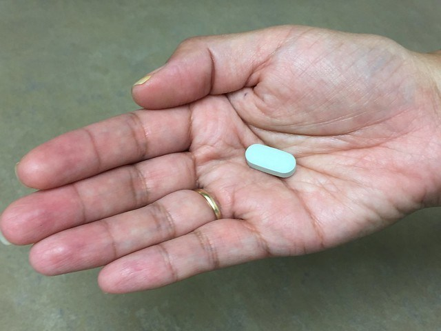

```{r setup, include=FALSE}
knitr::opts_chunk$set(echo = FALSE)
```

<https://www.brusselstimes.com/all-news/belgium-all-news/health/68651/belgian-researchers-unveil-breakthrough-discovery-in-hiv-treatment/>





Word count : 399


## Vocabulary 

| Words from the text | Synonym/explanation in English | French translation |
|--|--|--|
| Breakthrough | Major progress or advance | Percée|
| Inhibitors | Drug that prevents a chemical reaction | Inhibiteur |
| To keep at bay | To prevent getting closer or keeping silent| Prévenir |
| To boost | To promote | Stimuler |
| To acknowledge | To admit| Admettre|
| Novel | New, different | Novateur|
| To dispell | To scatter | Dissiper |
| Effort | Attempt| Effort |

## Analysis table 

|  |  |  |
|--|--|--|
| **Researchers** | Marie-Angelique De Scheerder and  Linos Vandekerckhove from UZ Gent University |
| **Date of publication and newspaper** | 18-09-2019 / *The Brussels Times* |
| **General topic** | Identification of the places where the residual cells hide |
| **Procedure / what was examined** | 11 patients stopped taking their antiretroviral treatment and were examined closely. The aim was to see when and where the virus would reappear. |
| **Conclusion / discovery** | The residual cells are hidden everywhere throughout the body. They are active cells |
| **Remaining questions** | How to fight these residual cells and how to eradicate them ? |


