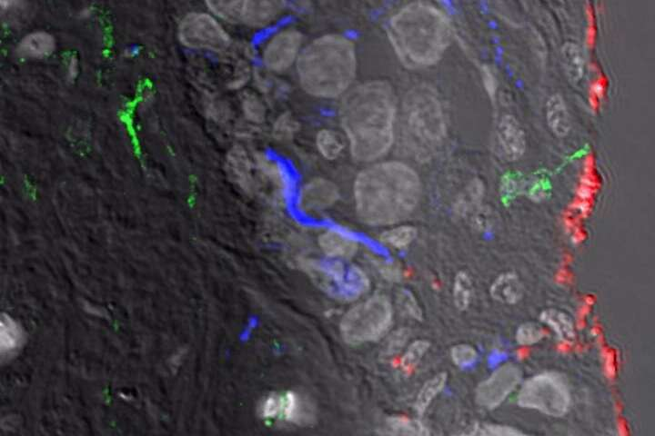

```{r setup, include=FALSE}
knitr::opts_chunk$set(echo = FALSE)
```





Word count : 591


## Vocabulary 

| Words from the text | Synonym/explanation in English | French translation |
|--|--|--|
| Dendritic | Having a branched form resembling a tree | En forme de dendrites |
| Foreskin | Fold of skin over the penis | Prépuce |
| Groundbreaking | Revolutionnary, innovative | Révolutionnaire, novateur |
| RNAscope | A novel RNA ISH (in situ hybridization) technology that allows simultaneous signal amplification and background suppression to achieve single-molecule visualization while preserving tissue morphology | RNAscope |
| To prime | To induce a susceptibility or proclivity (a tendency to choose or do something regularly) in | Amorcer, déclencher |


## Analysis table 

|  |  |  |
|--|--|--|
| **Researchers** | Andrew Harman and Tony Cunningham from The Westmead Institute for Medical Research |
| **Date of publication and newspaper** | 21-06-2019 / *Medical Xpress* |
| **General topic** | Discovery of the first immune cells that are on contact with HIV. |
| **Procedure / what was examined** | They look at genital tissues and used a new RNAscope technology which allowed them to one of these cells to take and transfer the virus.|
| **Conclusion / discovery** | These cells that are called CD11c+ dendritic cells capture a pathogen (in this case HIV virus) and communicate it to the CD4 T cells in the lymph nodes to help the immune system preparing. By doing so, they lead the HIV to their main targets, the CD4 T cells. |
| **Remaining questions** | Prevent HIV from binding to the CD11c+ dendritic cells ? Develop a vaccine ? |

<https://medicalxpress.com/news/2019-06-newly-immune-cells-frontline-hiv.html>
