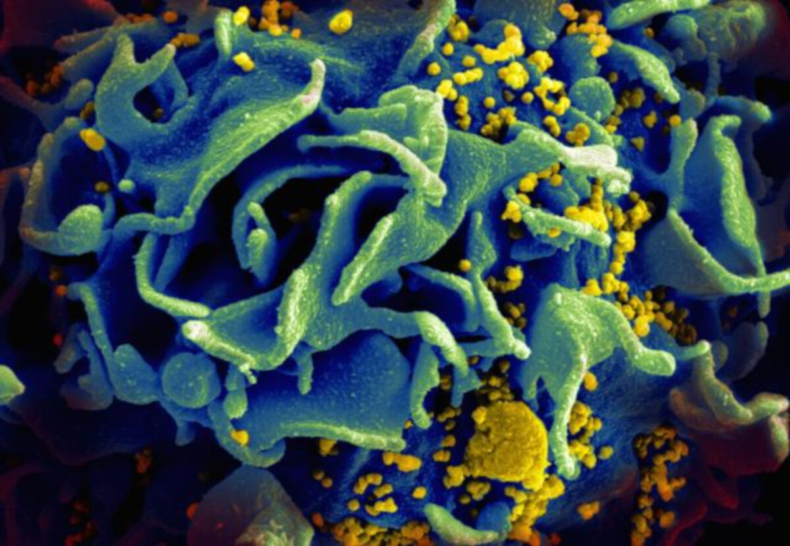

<https://www.sciencedaily.com/releases/2020/02/200210104118.htm>

Word count : 333

## Vocabulary 

| Words from the text | Synonym/explanation in English | French translation |
|--|--|--|
| Efflux | The flowing out of a substance or particle | Écoulement |
| Lipid raft | A micro domain of the plasma membrane, rich in cholesterol, sphingolipids and DHA1 (DocosaHexanoic Acid) | Radeau lipidique |
| Atherosclerosis | A form of arteriosclerosis (= hardening of the arteries) that is caused by a fatty substance building up inside the arteries, particularly due to bad transport of cholesterol and that can harden with calcium | Athérosclérose |
| Impairment | Deterioration in the functioning of a body part, organ, or system that can be temporary or permanent and can result from injury or disease | Déficience, insuffisance |
| To exert | To use something such as authority, power, influence, etc. in order to make something happen | Exercer |
| Budding | Growth, development | Bourgeonnement |

## Analysis table 

|  |  |  |
|--|--|--|
| **Researchers** | Michael Bukrinsky from the George Washington University |
| **Date of publication and newspaper** | 10-02-2020 / *ScienceDaily* |
| **General topic** | The effects of AIBP, a protein of our proteome, on lipid rafts and thus on HIV-1 infection. |
| **Procedure / what was examined** | They tried increasing and decreasing the rate of AIBP in the cells to see if it plays a role in HIV-1 infection. |
| **Conclusion / discovery** | An increase of AIBP reduces lipid rafts and inhibits HIV-1's replication. A decrease of it has the opposite effect. AIBP is an innate immunity element against HIV |
| **Remaining questions** | New way of treating HIV could be developped. AIBP may also protect cells from other viruses or pathogens |

