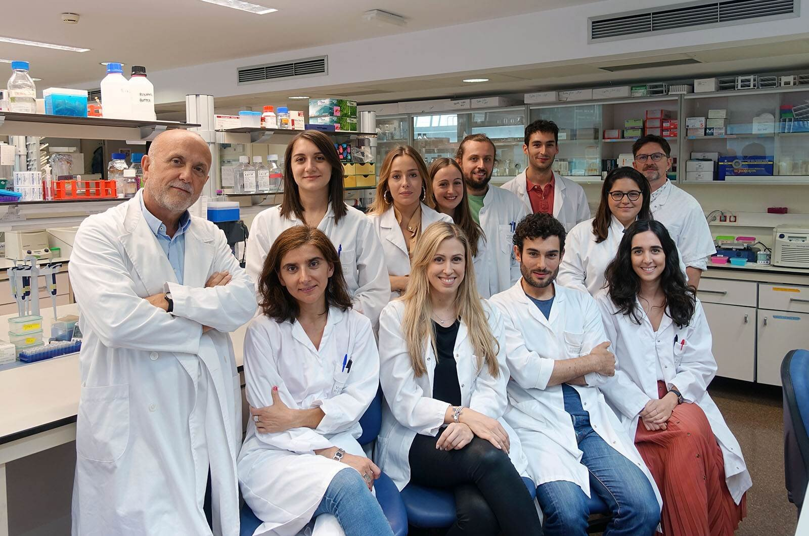

# Introduction

How about we take a look at A.I.D.S.

## HIV / A.I.D.S.

The Acquired Immune Deficiency Syndrome or **A.I.D.S.** is the associated disease of the Human Immunodefciency Virus commonly known as **HIV**.
The HIV is part of the virus family called **retroviruses** which means it is an RNA virus that transcript his genes backwards to insert them in the host cell's DNA. This has as a consequence that the host cell expresses viral genes like they were part of its initial genome. The HIV is spread by unprotected sex, blood transfusions, etc.

Infection by the HIV initiates with, after two to four weeks a stage of few or no symptoms which include fever, a flu-like illness, etc. It then develops and goes though another stage before reaching the final state of the infection : **A.I.D.S.**. People affected by A.I.D.S have low immunity and are thus subjects to various infections and tumors.

## My portfolio

Here, we are taking a look at this widespread disease for which we don't have a cure yet. Indeed most person infected by the virus are treated with **antiretroviral therapy**. What i am trying to do and to share is **understanding the disease** with the newest informations about the virus and the last discoveries/studies. I also have a particular interest in new approaches to treatments like **gene therapy and other new treatments**.

The articles of this portfolio will be sorted in three categories :

* Understanding the disease
* Antiretroviral therapy
* Gene therapy and other new treatments

I hope this portfolio will entertain your interest and, i am sure, make you learn some things.

# Article 1 : UC San Diego Researchers Isolate Switch that Kills Inactive HIV

Researchers have found a gene regulating HIV replication. Inactivating this gene would stop HIV multiplication.

Word count : 498

## Vocabulary 

| Words from the text | Synonym/explanation in English | French translation |
|--|--|--|
| Antiretroviral | Inhibiting the process by which a retrovirus (virus capable of reversal transcription into his host DNA) replicates | antirétroviral |
| Switch | On/off control | Interrupteur |
| Cessation | Stopping | Cessation |
| Emerged | Came to notice | Apparu |
| T cells | The immune cells that are the core of adaptative immunity | Lymphocytes T |
| Microglia | The main form of active immune defense in the central nervous system | Microglie |
| Recurring | Happening again | Réapparaître |

## Analysis table 

|  |  |  |
|--|--|--|
| **Researchers** | Tariq Rana, Ti-Chun Chao, Qiong Zhang, Zhonghan Li, Shashi Kant Tiwari, Yue Qin, Edwin Yau, Gatikrushna Singh, Kungyen Chang and Maile Ann Young Karris from UC San Diego; Ana Sanchez from Sanford Burnham Prebys Medical Discovery Institute; Marcus Kaul from Sanford Burnham Prebys Medical Discovery Institute and UC Riverside |
| **Date of publication and newspaper** | 24-09-2019 / *UC San Diego News Center* |
| **General topic** | Discovery of a gene that regulates HIV replication in immune cells |
| **Procedure / what was examined** | Antiretroviral therapy prevents HIV to infect the whole body and cause AIDS. It does not cure patients. When untreated, HIV spreads thgough the organism. HIV replication in immune cells are due to a gene discovered though genetic sequencing and called HEAL. Researchers found using biochemical and cellular techniques that suppressing or shutting this gene down would prevent HIV to multiply and spread. |
| **Conclusion / discovery** | The gene that regulates HIV replication was found. If it is inhibited it will prevent HIV multiplication. A cure could be developped with this discovery. |
| **Remaining questions** | How does the gene Heal come to be expressed when infected by the HIV ? How can we develop an effective cure ? |

# Article 2 : Belgian researchers unveil breakthrough discovery for HIV treatment

The university of Gent found where the residual cells of the disease hid.

Word count : 399

## Vocabulary 

| Words from the text | Synonym/explanation in English | French translation |
|--|--|--|
| Breakthrough | Major progress or advance | Percée|
| Inhibitors | Drug that prevents a chemical reaction | Inhibiteur |
| To keep at bay | To prevent getting closer or keeping silent| Prévenir |
| To boost | To promote | Stimuler |
| To acknowledge | To admit| Admettre|
| Novel | New, different | Novateur|
| To dispell | To scatter | Dissiper |
| Effort | Attempt| Effort |

## Analysis table 

|  |  |  |
|--|--|--|
| **Researchers** | Marie-Angelique De Scheerder and  Linos Vandekerckhove from UZ Gent University |
| **Date of publication and newspaper** | 18-09-2019 / *The Brussels Times* |
| **General topic** | Identification of the places where the residual cells hide |
| **Procedure / what was examined** | 11 patients stopped taking their antiretroviral treatment and were examined closely. The aim was to see when and where the virus would reappear. |
| **Conclusion / discovery** | The residual cells are hidden everywhere throughout the body. They are active cells |
| **Remaining questions** | How to fight these residual cells and how to eradicate them ? |

# Article 3 : New HIV drug launched

A new, more efficient antiretroviral therapy has been launched in Zimbabwe.

Word count : 451

## Vocabulary 

| Words from the text | Synonym/explanation in English | French translation |
|--|--|--|
| Rollout | Launch of a program or product | Lancement, mise en oeuvre |
| To take cognisance of | Acknowledge | Prendre connaissance de |
| Hence | Therefore | D'où |
| Screening | Scan for abnormalities | Dépistage |
| Facility | Building, unit | Complexe, établissement |

## Analysis table 

|  |  |  |
|--|--|--|
| **Researchers** | Dr. Owen Mugurungi |
| **Date of publication and newspaper** | 11-11-2019 / *Chronicle.co.zw* |
| **General topic** | A new antiretroviral drug has been launched in zimbabwe. |
| **Procedure / what was examined** | / |
| **Conclusion / discovery** | It has less side effects than the previous one. "It is more effective in viral supression". It inhibits the ability of the virus to replicate. |
| **Remaining questions** | Will the new medication be worth the switch ? Still this isn't a treatment that cures from HIV, will we discover one ? |

# Article 4 : Newly discovered immune cells at the frontline of HIV infection

New immune cells involved in HIV infection were discovered.

Word count : 591

## Vocabulary 

| Words from the text | Synonym/explanation in English | French translation |
|--|--|--|
| Dendritic | Having a branched form resembling a tree | En forme de dendrites |
| Foreskin | Fold of skin over the penis | Prépuce |
| Groundbreaking | Revolutionnary, innovative | Révolutionnaire, novateur |
| RNAscope | A novel RNA ISH (in situ hybridization) technology that allows simultaneous signal amplification and background suppression to achieve single-molecule visualization while preserving tissue morphology | RNAscope |
| To prime | To induce a susceptibility or proclivity (a tendency to choose or do something regularly) in | Amorcer, déclencher |

## Analysis table 

|  |  |  |
|--|--|--|
| **Researchers** | Andrew Harman and Tony Cunningham from The Westmead Institute for Medical Research |
| **Date of publication and newspaper** | 21-06-2019 / *Medical Xpress* |
| **General topic** | Discovery of the first immune cells that are on contact with HIV. |
| **Procedure / what was examined** | They look at genital tissues and used a new RNAscope technology which allowed them to one of these cells to take and transfer the virus.|
| **Conclusion / discovery** | These cells that are called CD11c+ dendritic cells capture a pathogen (in this case HIV virus) and communicate it to the CD4 T cells in the lymph nodes to help the immune system preparing. By doing so, they lead the HIV to their main targets, the CD4 T cells. |
| **Remaining questions** | Prevent HIV from binding to the CD11c+ dendritic cells ? Develop a vaccine ? |

# Article 5 : Newly developed approach shows promise in silencing HIV infection

A new way of treating HIV is being developped.

Word count : 478

## Vocabulary 

| Words from the text | Synonym/explanation in English | French translation |
|--|--|--|
| To wreak havoc | To cause great damage  | Faire des ravages |
| To harness | To utilize | Exploiter |
| Epigenetic | Relating to, being, or involving changes in gene function that do not involve changes in DNA sequence  | Epigénétique |
| Pharmacology | The science of drugs including their origin, composition, pharmacokinetics, therapeutic use, and toxicology | Pharmacologie |

## Analysis table 

|  |  |  |
|--|--|--|
| **Researchers** | Haitao Hu, Jia Zhou, Qingli Niu, Zhiqing Liu, Edrous Alamer, Xiuzhen Fan, Haiying Chen, Janice Endsley, Benjamin Gelman and Bing Tian from the UTMB and Jintanat Ananworanich, Nelson Michael, Jerome Kim and Merlin Robb from the U.S. Military HIV Research Program |
| **Date of publication and newspaper** | 06-08-2019 / *ScienceDaily* |
| **General topic** | Development of a new way of treating HIV that focuses on a protein regulating gene replication |
| **Procedure / what was examined** | They created a set of chemical coupounds they tested with the aim to make the target-protein destroy the HIV. They then applied further tests to the best coumpound. |
| **Conclusion / discovery** | It has considerably slown down the comeback of the HIV on an infection model. |
| **Remaining questions** | They will carry on with improving this kind of molecules. Effectiveness of a treatment ? |

# Article 6 : Taking shape: Scientists propose new structure for shell of HIV-1 virus

We may have misunderstood the shape of the virus. Scientists propose a new one.

Word count : 426

## Vocabulary 

| Words from the text | Synonym/explanation in English | French translation |
|--|--|--|
| Matrix | A mould | Matrice, moule |
| Capsid | The protein shell of a virus | Capside |
| Peculiar | Specific to | Charactéristique |
| Undergraduate | Person studying for first degree | Bachelier(ère) |
| A Cross-link (to cross-link) | A bond that links one polymer chain to another (to make that bond) | Réticulation (réticuler) |
| Alumnus | Someone who has left a school, college, or university after finishing their studies there | Alumnus |
| To come up with sth | To suggest or think of an idea or plan | Fourninr, proposer |
| Consistent | Matching other information | Qui correspond |

## Analysis table 

|  |  |  |
|--|--|--|
| **Researchers** | Sean Graves, Marcelo Marcet-Palacios and namely Weijie Sun from the university of Alberta |
| **Date of publication and newspaper** | 13-12-2019 / *ScienceDaily* |
| **General topic** | The shape of the HIV virus and its implications. |
| **Procedure / what was examined** | The shape previously used to visualise the HIV-1 virus shell was mathematically examined and proven to be impossible. Still with a mathematical approach, they tried to create a new model. |
| **Conclusion / discovery** | A new "flower-like" model with "petals" opening to inject the virus into the target cell is proposed. |
| **Remaining questions** | If it is correct, this new shape could lead to finding a way of blocking its mechanisms, namely those of viral entry. |

# Article 7 : Can Gene Therapy Cure HIV? US Gov't. Is Banking $100 Million On It.

The U.S. National Institutes of Health and The Bill & Melinda Gates Foundation are willing to cure HIV and sickle cell disease with gene therapies and will invest each 100 million dollars in 4 years on it.

Word count : 539

## Vocabulary 

| Words from the text | Synonym/explanation in English | French translation |
|--|--|--|
| Agency | Company that represents | Agence |
| Effort | An attempt for which you try hard | Effort |
| Critically | Significantly| Significativement, concrètement |
| Proviral DNA | Provirus : the genetic material of a virus as incorporated into, and able to replicate with, the genome of a host cell. | ADN proviral ou "Provirus" |
| To lurk | To wait hidden | Se cacher, se tapir, rôder |
| To tackle (a problem) | To get down on a problem and try to solve them | S'attaquer à (un problème) |

## Analysis table 

|  |  |  |
|--|--|--|
| **Researchers** | Dr. Francis Collins, director of the NIH, Dr. Anthony Fauci, director of The National Institute of Allergy and Infectious Diseases |
| **Date of publication and newspaper** | 23-10-2020 / *LiveScience* |
| **General topic** | Treatment of the HIV and the sickle cell disease with gene therapies |
| **Procedure / what was examined** | Antiretroviral does not cure HIV. Moreover, it is often times not affordable in some countries. Previous tries in gene therapies weren't more affordable either. They try here to develop gene therapies to cure those diseases and to dispense it at a reasonable price. They will focus on "In vivo" gates. |
| **Conclusion / discovery** | It will be a long-term investment for this alliance. |
| **Remaining questions** | One way to do this could be taking off the gene for the CCR5 receptor (useful to make the HIV enter the cells). A second way could be removing the proviral DNA that the retroviral virus printed into the genome (it still is present throughout the body after years of medication). |

# Article 8 : Antiretroviral HIV medication attenuates liver fibrosis

One medicine used for treating HIV has benefits on liver fibrosis.

Word count : 230

## Vocabulary 

| Words from the text | Synonym/explanation in English | French translation |
|--|--|--|
| Prevalence | High incidence | Prévalence |
| Preclinical | Of or pertaining to the period prior to the appearance of the symptoms | Préclinique |
| Stellate cells | Star-shaped cells located in the space of Disse whose role is unclear but mostly consists of storing vitamin A and producing fibrotic tissues when the liver is damaged | Cellule stellaire ou de Ito |
| Aetiology | Study, analysis of the causes (of a disease) | Étiologie |
| Retrospective study | A study using data already published | Étude rétrospective |
| Regimen | In this case : Particular medicines and their inherent rules | Régime |

## Analysis table 

|  |  |  |
|--|--|--|
| **Researchers** | Scientists from Valencia University (UV) |
| **Date of publication and newspaper** | 22-10-2019 / *MedicalXpress* |
| **General topic** | The effects of the antiretroviral therapy *Rilpivirine (RPV)* on liver fibrosis |
| **Procedure / what was examined** | Researchers were analysing the clinical data of patients contaminated with HIV and who were on various antiretroviral treatments and saw an improved liver function for those who were taking RPV. |
| **Conclusion / discovery** | RPV stops lipids from accumulating, has anti-inflammatory and anti-fibrotic properties and therefore reduce liver fibrosis. RPV has these effects on liver fibrosis no matter what caused it. |
| **Remaining questions** | We have to find specific treatments for liver fibrosis. This discovery is a first step to this. |

# Article 9 : Innate protein restricts HIV replication by targeting lipid rafts

AIBP, one of our proteins, acts on particular parts of our cells' plasma membrane which are useful to HIV-1 when infecting a cell.

Word count : 333

## Vocabulary 

| Words from the text | Synonym/explanation in English | French translation |
|--|--|--|
| Efflux | The flowing out of a substance or particle | Écoulement |
| Lipid raft | A micro domain of the plasma membrane, rich in cholesterol, sphingolipids and DHA1 (DocosaHexanoic Acid) | Radeau lipidique |
| Atherosclerosis | A form of arteriosclerosis (= hardening of the arteries) that is caused by a fatty substance building up inside the arteries, particularly due to bad transport of cholesterol and that can harden with calcium | Athérosclérose |
| Impairment | Deterioration in the functioning of a body part, organ, or system that can be temporary or permanent and can result from injury or disease | Déficience, insuffisance |
| To exert | To use something such as authority, power, influence, etc. in order to make something happen | Exercer |
| Budding | Growth, development | Bourgeonnement |

## Analysis table 

|  |  |  |
|--|--|--|
| **Researchers** | Michael Bukrinsky from the George Washington University |
| **Date of publication and newspaper** | 10-02-2020 / *ScienceDaily* |
| **General topic** | The effects of AIBP, a protein of our proteome, on lipid rafts and thus on HIV-1 infection. |
| **Procedure / what was examined** | They tried increasing and decreasing the rate of AIBP in the cells to see if it plays a role in HIV-1 infection. |
| **Conclusion / discovery** | An increase of AIBP reduces lipid rafts and inhibits HIV-1's replication. A decrease of it has the opposite effect. AIBP is an innate immunity element against HIV |
| **Remaining questions** | New way of treating HIV could be developped. AIBP may also protect cells from other viruses or pathogens |

# Article 10 : Second patient cured of HIV, say doctors

Adam Castillejo is free of the HIV for now two years and a half. He is the second reported case ever.

Word count : 648

## Vocabulary 

| Words from the text | Synonym/explanation in English | French translation |
|--|--|--|
| Semen | Sperm | Semence, sperme |
| Haematological | Relating to study of blood disease | Hématologique |
| Malignancies | Life threatening cancer | Malignité |
| Humbling | That makes you less arogant | Qui rend humble |

## Analysis table 

|  |  |  |
|--|--|--|
| **Researchers** | Ravindra Kumar Gupta from the University of Cambridge |
| **Date of publication and newspaper** | 10-03-2020 / *BBC NEWS* |
| **General topic** | A man living in London is considered cured of HIV |
| **Procedure / what was examined** | The patient, as well as the first ever case of HIV recovery, were also suffering from leukemia. They underwent a stem cell transplant for their cancer. The donors had a rare mutation on the CCR5 receptor gene - which is used by HIV-1 to enter cells - that make them immune to HIV-1 infection. |
| **Conclusion / discovery** | The two patients undergoing the stem cells transplant are now considered cured of HIV |
| **Remaining questions** | Although it won't be a treatment for all people infected by the virus, it installs a new path to a cure. |

# Conclusion

One day the A.I.D.S. symbol will be flipped into a 'V' for victory.

# My blog in a nutshell

The HIV is a virus still full of mysteries. Numerous scientists are trying to see through its secrets and yet, we haven't developed any cure. Indeed, most HIV positive people are on antiretroviral therapy which helps them to live a normal life, but without being cured. 

However, the future is promising. We go through more and more discoveries and some of them are breakthough like the place where the virus hide in our body.
Two people have even been cured of HIV ! How extraordinary this is ? We know that with a certain mutation of a certain gene, we can be immune to HIV.

So, there is hope. Hope of finding a cure one day and eradicate this scary virus.

# My thoughts

It was very interesting reading about new major discoveries and new paths to finding a cure. I am not disapointed of the things that i've learned. It was also very interesting and kind of fun to see that antiretroviral therapy could improve conditions for people with liver fibrosis. It shows us that we are not safe from surprises, and that good news can come from a bad situation.

I hope reading this portfolio was pleasant to you and that it caught your interest.

# Bibliography

<https://ucsdnews.ucsd.edu/pressrelease/uc-san-diego-researchers-isolate-switch-that-kills-inactive-hiv>

<https://www.brusselstimes.com/all-news/belgium-all-news/health/68651/belgian-researchers-unveil-breakthrough-discovery-in-hiv-treatment/>

<https://www.chronicle.co.zw/new-hiv-drug-launched/>

<https://medicalxpress.com/news/2019-06-newly-immune-cells-frontline-hiv.html>

<https://www.sciencedaily.com/releases/2019/08/190806121149.htm>

<https://www.sciencedaily.com/releases/2019/12/191213124917.htm>

<https://www.livescience.com/hiv-gene-therapy-cure-nih.html>

<https://medicalxpress.com/news/2019-10-antiretroviral-hiv-medication-attenuates-liver.html>

<https://www.sciencedaily.com/releases/2020/02/200210104118.htm>

<https://www.bbc.com/news/health-51804454>
